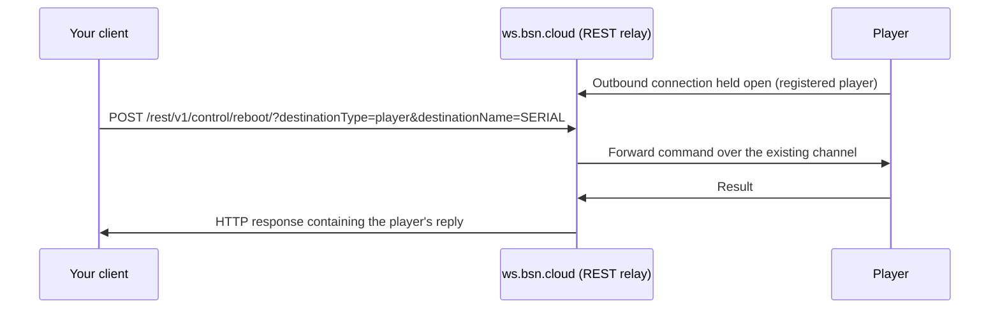

# Per-Player Control

[← Back to Part 5: BrightSign Control](README.md) | [↑ Main](../../README.md)

---

## Introduction

Once a player is registered with BrightSign Control it becomes individually addressable from anywhere, without a VPN or an inbound firewall rule. This chapter covers **Remote DWS (RDWS)** — the mechanism BrightSign Control uses to reach a single named player and run diagnostic and control operations against it.

The local equivalent, the Local Diagnostic Web Server, is covered in [Setting Up Your Development Environment](../../howto-articles/01-setting-up-development-environment.md). Read that first: the two surfaces expose nearly the same routes, and everything you know about one transfers to the other.

---

## How Remote DWS Reaches a Player

Players do not accept inbound connections. Each registered player holds an **outbound** connection to BrightSign Control, and the cloud pushes commands down that existing channel. That is why RDWS works through NAT and corporate firewalls with no port forwarding.



**Your client speaks REST, not WebSocket.** You do not hold a socket to the player yourself. You make an ordinary HTTP request to the relay, the relay forwards it to the player and waits, and the player's reply comes back in your HTTP response body. A slow player means a slow HTTP response.

---

## Network Requirements

The device side of this needs nothing more than outbound HTTPS/WSS on port 443 to:

| Host | Purpose |
|------|---------|
| `api.bsn.cloud` | Main REST API |
| `auth.bsn.cloud` | OAuth2 token issuance |
| `cdn.bsn.cloud` | Content delivery |
| `dws.bsn.cloud` | Device WebSocket gateway |
| `ws.bsn.cloud` | Remote DWS REST relay |

No inbound rules are required. If RDWS is failing for an entire site, check egress filtering on these hosts before investigating individual players.

---

## Calling the Remote DWS REST Relay

**Base URL:** `https://ws.bsn.cloud/rest/v1/`

**Authentication:** the same BrightSign Control OAuth2 bearer token used for the rest of the platform, obtained from `https://api.bsn.cloud/2022/06/REST/Token/`. The target player must belong to the network the token was granted for — a valid token for the wrong network fails.

**Addressing the player** uses query parameters, not a path segment:

| Parameter | Value |
|-----------|-------|
| `destinationType` | `player` (the only accepted value) |
| `destinationName` | The player's serial number |

```bash
curl -X GET \
  -H "Authorization: Bearer $BSN_TOKEN" \
  "https://ws.bsn.cloud/rest/v1/info/?destinationType=player&destinationName=$SERIAL"
```

### Four things that will bite you

**URLs are case-sensitive, and a mismatch returns HTTP 426.** `426 Upgrade Required` is not an obvious signal that you mistyped a path, and it is easy to lose an hour to it. When you see a 426, check your casing before anything else.

**Requests wrap the body in an outer `data` object.** A route that takes an `enabled` boolean wants:

```json
{"data": {"enabled": false}}
```

**Responses echo the request alongside the result:**

```json
{"route": "/info/", "method": "GET", "data": {"result": { }}}
```

**Routes mirror the Local DWS minus the `/api` prefix.** Local `GET /api/v1/info` is remote `GET /info/`.

---

## Route Coverage

Routes shared with the Local DWS:

| Purpose | Route |
|---------|-------|
| Identity and health | `/info/`, `/health/`, `/time/` |
| Files | `/files/{:path}/` |
| Reboot | `/control/reboot/` |
| Registry | `/registry/:section/:key` |
| Logs | `/logs/` |
| Enable SSH / Telnet | `/diagnostics/ssh/`, `/diagnostics/telnet/` |
| Screenshot | `/snapshot/` |
| Display control | `/display-control/...` |

Routes that exist **only** on the remote surface:

| Route | Purpose |
|-------|---------|
| `/re-provision/` | Force the player back through B-Deploy provisioning |
| `/download-firmware/` | Push a firmware update |
| `/custom/` | Vendor/custom extension endpoints |
| `/remoteview/...` | Live remote view of the player's output |

---

## `/re-provision/` Is Close to a Factory Reset

> **This is the most destructive route on the remote surface. Do not fire it casually or expose it behind a convenience button in an operations UI.**

`GET /re-provision/` behaves differently depending on whether the player still holds BrightSign Control credentials:

**With BrightSign Control access/refresh tokens present in the `networking` registry section:** a set of setup-related keys is preserved and **the rest of the registry is deleted**.

**With no tokens present:** the **entire `networking` section is emptied** and the SD card is formatted.

In both cases **all files are removed from the default storage device** and the player reboots to re-provision from B-Deploy.

The keys preserved in the first case are network, proxy, and rate-limit configuration only:

`inp`, `networkjson`, `modem_json`, `wifi`, `ss`, `pp`, `dhcp`, `sip`, `sm`, `gw`, `dns1`-`dns3` and their `…2` variants, `ncp`, `up`, `ps`, `bph`, `ts`, and the `rlm*`/`rlr*` rate-limit keys.

Anything else your application stored in the registry — including its own configuration — is gone.

---

## Common Operations

**Reboot a player:**

```bash
curl -X PUT \
  -H "Authorization: Bearer $BSN_TOKEN" \
  -H "Content-Type: application/json" \
  -d '{"data": {}}' \
  "https://ws.bsn.cloud/rest/v1/control/reboot/?destinationType=player&destinationName=$SERIAL"
```

**Take a screenshot:**

```bash
curl -X POST \
  -H "Authorization: Bearer $BSN_TOKEN" \
  "https://ws.bsn.cloud/rest/v1/snapshot/?destinationType=player&destinationName=$SERIAL"
```

**Read a registry key:**

```bash
curl -X GET \
  -H "Authorization: Bearer $BSN_TOKEN" \
  "https://ws.bsn.cloud/rest/v1/registry/networking/ssh?destinationType=player&destinationName=$SERIAL"
```

**Enable SSH remotely** (development players only — see [Secure Deployment Practices](../../howto-articles/19-secure-deployment-practices.md)):

```bash
curl -X PUT \
  -H "Authorization: Bearer $BSN_TOKEN" \
  -H "Content-Type: application/json" \
  -d '{"data": {"enabled": true, "portNumber": 22, "password": "<temp-dev-password>"}}' \
  "https://ws.bsn.cloud/rest/v1/diagnostics/ssh/?destinationType=player&destinationName=$SERIAL"
```

---

## Calling This From Go

For anything beyond one-off `curl` calls, use the **[gopurple SDK](https://github.com/BrightDevelopers/gopurple)**, which handles OAuth2 token lifecycle, retry/backoff, and the `data` envelope for you. Its `client.RDWS` sub-service covers the remote surface, and the `rdws-*` example programs are runnable CLI tools you can use directly.

```go
client, _ := gopurple.New()
client.Authenticate(ctx)
info, err := client.RDWS.GetInfo(ctx, serial)
```

Check `docs/all-apis.md` in the SDK for `[DONE]`/`[NOT-DONE]` status before assuming a specific endpoint is implemented — the SDK covers a deliberate subset of the platform surface.

---

## Troubleshooting

| Symptom | Likely cause |
|---------|--------------|
| HTTP 426 | URL case mismatch — check casing before anything else |
| HTTP 401/403 | Token expired, or the player is not in the token's network |
| Request times out | Player is offline, or egress to `ws.bsn.cloud` is blocked at the site |
| Route 404s on one player but works on another | Player is on an older BrightSignOS release that predates the route |
| Every route fails on a player you are also SSHed into | You descended to the root Linux shell and stopped the Supervisor, which serves the DWS. Reboot the player. |

That last row is worth internalizing: the Supervisor is the player's control plane and serves both the local and remote DWS surfaces. If you have dropped below the BrightSign Shell into the root Linux shell over SSH, the Supervisor is no longer running and **no** DWS call will succeed — local or remote.

Note the trap this creates: you cannot use `/control/reboot/` to recover, because that route is served by the process you stopped. From the root shell the only way back to a running player is to type **`exit`** at the `#` prompt, which reboots it. Remote recovery is not possible from that state — someone needs the SSH session.

---

## Related Resources

- [Integrating with BrightSign Control](01-integrating-with-bsn-cloud.md) — platform overview, authentication, device management
- [Automated Provisioning](02-automated-provisioning.md) — getting players enrolled in the first place
- [Setting Up BrightSign Control](../../howto-articles/10-setting-up-bsn-cloud.md) — step-by-step account and player setup
- [gopurple SDK](https://github.com/BrightDevelopers/gopurple) — Go client for these APIs

---

[↑ Part 5: BrightSign Control](README.md)
